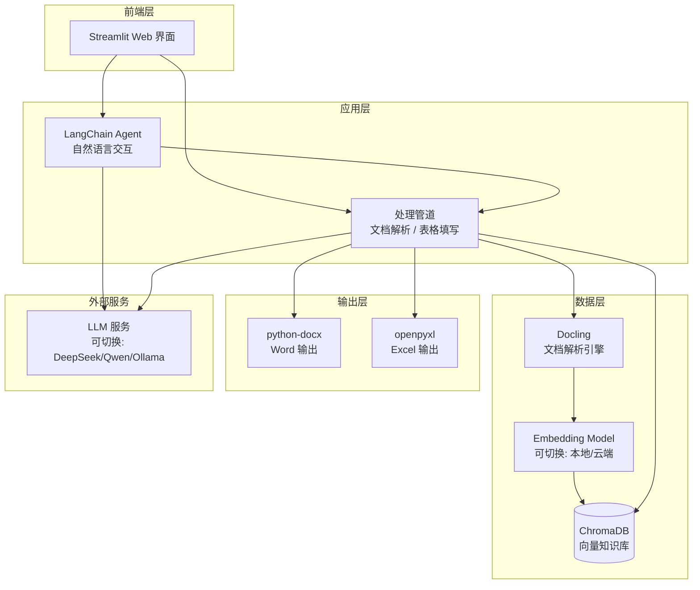
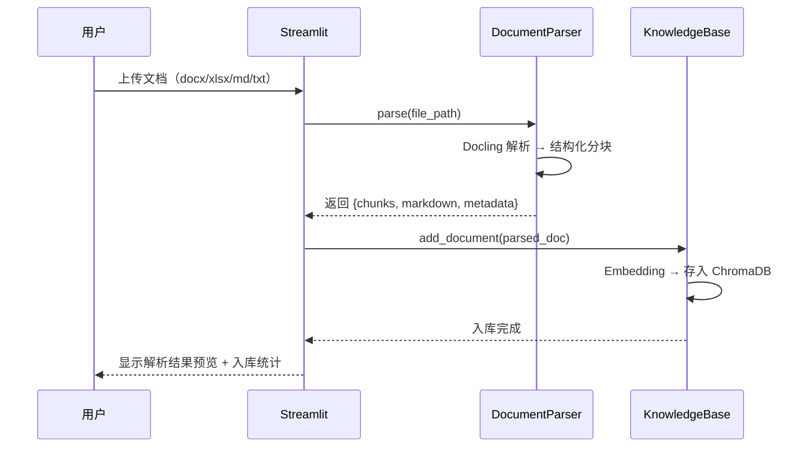
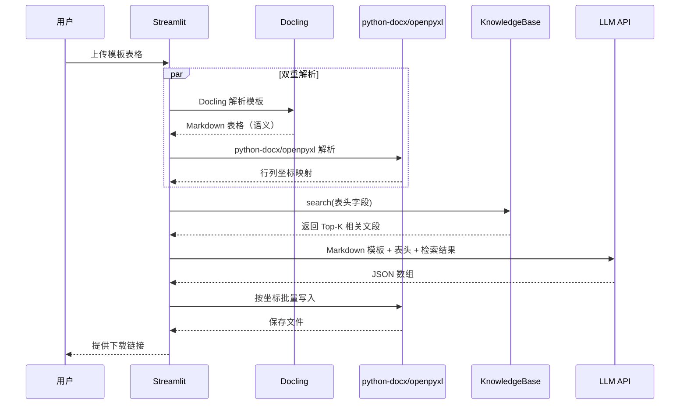

# 基于大语言模型的文档理解与多源数据融合系统 — 开发文档

## 一、项目概述

### 1.1 目标

构建一个智能文档处理系统，能够：
1. 自动解析多格式文档（docx/xlsx/md/txt），提取关键信息并建立知识库
2. 通过自然语言交互操作文档
3. 根据用户提供的模板表格，从知识库中检索数据并自动填写

### 1.2 技术栈

| 层次 | 技术选型 | 版本建议 |
|------|---------|---------|
| 文档解析 | Docling (IBM) | ≥ 2.x |
| 向量数据库 | ChromaDB | ≥ 0.5.x |
| LLM 框架 | LangChain | ≥ 0.3.x |
| 嵌入模型 | **可切换**：本地 Sentence-Transformers / 云端 API | ≥ 3.x |
| LLM 服务 | **可切换**：DeepSeek / Qwen / Ollama（本地） | — |
| Word 操作 | python-docx | ≥ 1.x |
| Excel 操作 | openpyxl | ≥ 3.1 |
| 前端界面 | Streamlit | ≥ 1.38 |
| Python | CPython | 3.10 - 3.12 |

> **默认测试配置**：嵌入模型使用 `bge-small-zh-v1.5`（95MB，CPU 友好），LLM 使用 DeepSeek API。
> 均可通过 `.env` 文件一键切换为其他模型或云端 API。

---

## 二、系统架构

### 2.1 整体架构图



### 2.2 数据流

```
用户上传文档 → Docling 解析为结构化内容 → 按结构边界分块 → Embedding 向量化 → 存入 ChromaDB
                                                                                    ↑
用户上传模板表格 → 解析表头字段 → LLM 生成检索查询 → ChromaDB 语义检索 → LLM 提取精确值 → 写入文件输出
```

---

## 三、项目目录结构

```
intelligent-algorithm/
├── app.py                      # Streamlit 主入口
├── config.py                   # 全局配置（API Key、模型名、路径等）
├── requirements.txt            # Python 依赖
├── start.bat                   # Windows 一键启动脚本
├── .env                        # 环境变量（API Key，不提交 Git）
│
├── core/                       # 核心业务逻辑
│   ├── __init__.py
│   ├── document_parser.py      # 模块一：Docling 文档解析
│   ├── knowledge_base.py       # ChromaDB 知识库管理
│   ├── retriever.py            # RAG 检索逻辑
│   ├── table_filler.py         # 模块三：表格自动填写
│   └── agent.py                # 模块二：LangChain Agent 交互
│
├── utils/                      # 工具函数
│   ├── __init__.py
│   ├── file_utils.py           # 文件读写辅助
│   ├── template_parser.py      # 模板表头解析
│   └── schema.py               # Pydantic 数据模型
│
├── pages/                      # Streamlit 多页面
│   ├── 1_📄_文档上传.py         # 文档上传与解析页面
│   ├── 2_💬_智能问答.py         # 对话交互页面
│   └── 3_📊_表格填写.py         # 模板填写页面
│
├── data/                       # 运行时数据（Git 忽略）
│   ├── uploads/                # 用户上传的原始文件
│   ├── chroma_db/              # ChromaDB 持久化目录
│   └── outputs/                # 生成的填写完成的文件
│
└── tests/                      # 测试
    ├── test_parser.py
    ├── test_retriever.py
    └── test_filler.py
```

---

## 四、核心模块详细设计

### 4.1 模块一：非结构化文档信息提取（document_parser.py + knowledge_base.py）

#### 4.1.1 职责

将用户上传的多格式文档解析为结构化内容，分块后嵌入 ChromaDB 知识库。

#### 4.1.2 核心类

```python
# core/document_parser.py

from docling.document_converter import DocumentConverter
from docling_core.transforms.chunker import HierarchicalChunker

class DocumentParser:
    """基于 Docling 的文档解析器"""

    def __init__(self):
        self.converter = DocumentConverter()
        self.chunker = HierarchicalChunker()

    def parse(self, file_path: str) -> dict:
        """
        解析单个文档，返回结构化结果
        
        Returns:
            {
                "file_name": str,
                "markdown": str,         # 完整 Markdown 文本
                "chunks": list[str],      # 结构化分块列表
                "metadata": dict          # 文件元信息
            }
        """
        result = self.converter.convert(file_path)
        doc = result.document

        # 按结构边界分块（标题/段落/表格）
        chunks = list(self.chunker.chunk(doc))

        return {
            "file_name": file_path.name,
            "markdown": doc.export_to_markdown(),
            "chunks": [chunk.text for chunk in chunks],
            "metadata": {
                "source": str(file_path),
                "format": file_path.suffix,
            }
        }

    def parse_batch(self, file_paths: list[str]) -> list[dict]:
        """批量解析多个文档"""
        return [self.parse(fp) for fp in file_paths]
```

```python
# core/knowledge_base.py

import chromadb
from config import Config

def create_embedding_function():
    """根据配置创建嵌入函数（本地或云端）"""
    if Config.EMBEDDING_PROVIDER == "local":
        from chromadb.utils.embedding_functions import SentenceTransformerEmbeddingFunction
        return SentenceTransformerEmbeddingFunction(
            model_name=Config.EMBEDDING_MODEL  # 默认: BAAI/bge-small-zh-v1.5
        )
    elif Config.EMBEDDING_PROVIDER == "openai":
        from chromadb.utils.embedding_functions import OpenAIEmbeddingFunction
        return OpenAIEmbeddingFunction(
            api_key=Config.EMBEDDING_API_KEY,
            api_base=Config.EMBEDDING_BASE_URL,
            model_name=Config.EMBEDDING_MODEL
        )
    elif Config.EMBEDDING_PROVIDER == "dashscope":
        # 阿里通义千问 Embedding
        from langchain_community.embeddings import DashScopeEmbeddings
        return DashScopeEmbeddings(
            model=Config.EMBEDDING_MODEL,
            dashscope_api_key=Config.EMBEDDING_API_KEY
        )
    else:
        raise ValueError(f"不支持的 Embedding 提供商: {Config.EMBEDDING_PROVIDER}")

class KnowledgeBase:
    """ChromaDB 向量知识库"""

    def __init__(self, persist_dir: str = None):
        self.embed_fn = create_embedding_function()
        self.client = chromadb.PersistentClient(
            path=persist_dir or Config.CHROMA_PERSIST_DIR
        )
        self.collection = self.client.get_or_create_collection(
            name="documents",
            embedding_function=self.embed_fn,
            metadata={"hnsw:space": "cosine"}
        )

    def add_document(self, parsed_doc: dict):
        """将解析后的文档分块入库"""
        chunks = parsed_doc["chunks"]
        ids = [f"{parsed_doc['file_name']}_{i}" for i in range(len(chunks))]
        metadatas = [
            {
                "source": parsed_doc["file_name"],
                "format": parsed_doc["metadata"]["format"],
                "chunk_index": i
            }
            for i in range(len(chunks))
        ]
        self.collection.add(
            documents=chunks,
            ids=ids,
            metadatas=metadatas
        )

    def search(self, query: str, top_k: int = None) -> list[dict]:
        """语义检索"""
        results = self.collection.query(
            query_texts=[query],
            n_results=top_k or Config.RETRIEVAL_TOP_K
        )
        return [
            {"text": doc, "metadata": meta, "distance": dist}
            for doc, meta, dist in zip(
                results["documents"][0],
                results["metadatas"][0],
                results["distances"][0]
            )
        ]

    def get_stats(self) -> dict:
        """返回知识库统计信息"""
        return {"total_chunks": self.collection.count()}
```

#### 4.1.3 入库流程



---

### 4.2 模块二：文档智能操作交互（agent.py）

#### 4.2.1 职责

用户通过自然语言与系统对话，查询知识库、分析文档内容、触发表格填写等。

#### 4.2.2 核心实现

```python
# core/agent.py

from langchain.agents import create_tool_calling_agent, AgentExecutor
from langchain_core.prompts import ChatPromptTemplate, MessagesPlaceholder
from langchain.tools import tool
from core.knowledge_base import KnowledgeBase
from core.llm_factory import create_llm

class DocumentAgent:
    """基于 LangChain 的文档智能 Agent"""

    def __init__(self, knowledge_base: KnowledgeBase):
        self.kb = knowledge_base
        self.llm = create_llm()  # 根据 Config 自动选择 LLM 后端
        self.tools = self._build_tools()
        self.agent = self._build_agent()

    def _build_tools(self):
        kb = self.kb

        @tool
        def search_documents(query: str) -> str:
            """从知识库中搜索与 query 相关的文档内容。
            当用户询问文档中的信息时使用此工具。"""
            results = kb.search(query, top_k=5)
            if not results:
                return "未找到相关内容。"
            return "\n\n---\n\n".join(
                f"[来源: {r['metadata']['source']}]\n{r['text']}"
                for r in results
            )

        @tool
        def get_knowledge_base_info() -> str:
            """获取知识库的统计信息，包括已入库的文档数和分块数。"""
            stats = kb.get_stats()
            return f"知识库中共有 {stats['total_chunks']} 个文档分块。"

        return [search_documents, get_knowledge_base_info]

    def _build_agent(self):
        prompt = ChatPromptTemplate.from_messages([
            ("system", """你是一个文档理解助手。你可以帮助用户：
1. 查询已上传文档中的信息
2. 分析和总结文档内容
3. 回答关于文档的问题

请根据检索到的文档内容回答，如果信息不足请如实说明。"""),
            MessagesPlaceholder(variable_name="chat_history"),
            ("human", "{input}"),
            MessagesPlaceholder(variable_name="agent_scratchpad"),
        ])

        agent = create_tool_calling_agent(self.llm, self.tools, prompt)
        return AgentExecutor(agent=agent, tools=self.tools, verbose=True)

    def chat(self, message: str, chat_history: list = None) -> str:
        """处理用户消息并返回回复"""
        result = self.agent.invoke({
            "input": message,
            "chat_history": chat_history or []
        })
        return result["output"]
```

---

### 4.3 模块三：表格自动填写（table_filler.py + template_parser.py）

#### 4.3.1 职责

解析用户上传的模板表格结构，从知识库检索数据，LLM 提取精确值后批量写入。

#### 4.3.2 设计思路：Docling + python-docx/openpyxl 双重解析

模板解析分两层，各取所长：

| 层 | 工具 | 产出 | 给谁用 |
|----|------|------|--------|
| **语义层** | Docling | 干净的 Markdown 表格 | 给 LLM 理解"要填什么" |
| **坐标层** | python-docx / openpyxl | 行列索引、单元格引用 | 给代码知道"往哪里填" |

#### 4.3.3 模板解析器

```python
# utils/template_parser.py

from docx import Document as DocxDocument
from openpyxl import load_workbook
from core.document_parser import DocumentParser

class TemplateParser:
    """双重解析模板表格：Docling（语义） + python-docx/openpyxl（坐标）"""

    def __init__(self):
        self.doc_parser = DocumentParser()

    def parse_template(self, file_path: str) -> dict:
        """
        统一解析入口，返回语义描述 + 坐标映射
        
        Returns:
            {
                "markdown": str,          # Docling 输出的 Markdown（给 LLM 看）
                "coordinates": list[dict]  # 行列坐标映射（给代码写入用）
            }
        """
        suffix = file_path.split(".")[-1].lower()

        # 1. Docling 解析 -> 干净的 Markdown 表格（LLM 能直观看到表格长什么样）
        docling_result = self.doc_parser.parse(file_path)
        markdown = docling_result["markdown"]

        # 2. python-docx / openpyxl 解析 -> 精确坐标（代码写入需要）
        if suffix == "docx":
            coordinates = self._parse_word_coordinates(file_path)
        elif suffix in ("xlsx", "xls"):
            coordinates = self._parse_excel_coordinates(file_path)
        else:
            raise ValueError(f"Unsupported template format: {suffix}")

        return {"markdown": markdown, "coordinates": coordinates}

    @staticmethod
    def _parse_word_coordinates(file_path: str) -> list[dict]:
        """用 python-docx 提取 Word 表格的行列坐标"""
        doc = DocxDocument(file_path)
        tables_info = []
        for idx, table in enumerate(doc.tables):
            rows_data = []
            for row in table.rows:
                row_text = [cell.text.strip() for cell in row.cells]
                rows_data.append(row_text)
            headers = rows_data[0] if rows_data else []
            tables_info.append({
                "table_index": idx,
                "headers": headers,
                "row_count": len(rows_data),
                "structure": rows_data
            })
        return tables_info

    @staticmethod
    def _parse_excel_coordinates(file_path: str) -> list[dict]:
        """用 openpyxl 提取 Excel 表头的单元格坐标"""
        wb = load_workbook(file_path, read_only=True)
        sheets_info = []
        for sheet_name in wb.sheetnames:
            ws = wb[sheet_name]
            headers = {}
            for col_idx, cell in enumerate(ws[1], 1):
                if cell.value:
                    col_letter = chr(64 + col_idx) if col_idx <= 26 else f"A{chr(64 + col_idx - 26)}"
                    headers[f"{col_letter}1"] = str(cell.value)
            sheets_info.append({
                "sheet_name": sheet_name,
                "headers": headers,
                "header_row": 1,
                "max_column": ws.max_column
            })
        wb.close()
        return sheets_info
```

#### 4.3.4 表格填写引擎

```python
# core/table_filler.py

import json
from langchain_core.prompts import ChatPromptTemplate
from docx import Document as DocxDocument
from openpyxl import load_workbook
from core.knowledge_base import KnowledgeBase
from core.llm_factory import create_llm
from utils.template_parser import TemplateParser

class TableFiller:
    """表格自动填写引擎"""

    def __init__(self, knowledge_base: KnowledgeBase):
        self.kb = knowledge_base
        self.llm = create_llm()
        self.template_parser = TemplateParser()

    def fill_template(self, template_path: str, output_path: str) -> dict:
        """
        自动填写模板表格

        流程：
        1. Docling 解析模板 -> Markdown（给 LLM 理解语义）
        2. python-docx/openpyxl 解析 -> 坐标映射（给代码写入）
        3. ChromaDB 检索相关数据
        4. LLM 看 Markdown 模板 + 检索结果 -> 输出 JSON
        5. 按坐标写入文件
        """
        # 双重解析
        parsed = self.template_parser.parse_template(template_path)
        template_md = parsed["markdown"]        # Docling 输出，给 LLM 看
        coordinates = parsed["coordinates"]     # 精确坐标，给代码用

        suffix = template_path.split(".")[-1].lower()
        if suffix == "docx":
            return self._fill_word(template_path, output_path, template_md, coordinates)
        elif suffix in ("xlsx", "xls"):
            return self._fill_excel(template_path, output_path, template_md, coordinates)
        else:
            raise ValueError(f"Unsupported: {suffix}")

    def _fill_word(self, template_path, output_path, template_md, coordinates):
        doc = DocxDocument(template_path)
        total_filled = 0
        for table_info in coordinates:
            headers = table_info["headers"]
            table = doc.tables[table_info["table_index"]]
            retrieved = self.kb.search(", ".join(headers))
            context = "\n\n".join([r["text"] for r in retrieved])
            fill_data = self._extract_data(template_md, headers, context)
            if fill_data:
                for row_idx, row_data in enumerate(fill_data):
                    actual_row = row_idx + 1
                    if actual_row >= len(table.rows):
                        table.add_row()
                    row = table.rows[actual_row]
                    for col_idx, header in enumerate(headers):
                        if col_idx < len(row.cells) and header in row_data:
                            row.cells[col_idx].text = str(row_data[header])
                            total_filled += 1
        doc.save(output_path)
        return {"status": "success", "filled_cells": total_filled, "output_path": output_path}

    def _fill_excel(self, template_path, output_path, template_md, coordinates):
        wb = load_workbook(template_path)
        total_filled = 0
        for sheet_info in coordinates:
            ws = wb[sheet_info["sheet_name"]]
            headers = sheet_info["headers"]
            header_names = list(headers.values())
            retrieved = self.kb.search(", ".join(header_names))
            context = "\n\n".join([r["text"] for r in retrieved])
            fill_data = self._extract_data(template_md, header_names, context)
            if fill_data:
                for row_idx, row_data in enumerate(fill_data):
                    excel_row = row_idx + 2
                    for col_cell, header_name in headers.items():
                        col_letter = col_cell[0]
                        if header_name in row_data:
                            ws[f"{col_letter}{excel_row}"] = row_data[header_name]
                            total_filled += 1
        wb.save(output_path)
        return {"status": "success", "filled_cells": total_filled, "output_path": output_path}

    def _extract_data(self, template_md: str, headers: list[str], context: str):
        """LLM 看 Docling Markdown 模板 + 检索结果 -> 提取精确数据"""
        prompt = ChatPromptTemplate.from_messages([
            ("system", """你是一个数据提取专家。根据模板表格结构和文档内容，提取数据。

## 模板表格（Markdown）
{template_md}

## 要求
1. 严格按照表头字段提取：{headers}
2. 找不到的字段填 "N/A"
3. 返回纯 JSON 数组，每个元素是一行数据
4. 尽可能多地提取符合条件的数据行

直接返回 JSON 数组，不要其他文字。"""),
            ("human", "以下是知识库检索到的文档内容：\n\n{context}")
        ])
        chain = prompt | self.llm
        response = chain.invoke({
            "template_md": template_md,
            "headers": json.dumps(headers, ensure_ascii=False),
            "context": context
        })
        try:
            return json.loads(response.content)
        except json.JSONDecodeError:
            import re
            match = re.search(r'\[.*\]', response.content, re.DOTALL)
            return json.loads(match.group()) if match else []
```

#### 4.3.5 表格填写流程图



---

## 五、前端页面设计

### 5.1 页面结构（Streamlit 多页面模式）

```python
# app.py — 主入口

import streamlit as st

st.set_page_config(
    page_title="文档智能系统",
    page_icon="📄",
    layout="wide"
)

st.title("📄 基于大语言模型的文档理解与多源数据融合系统")
st.markdown("---")

# 侧边栏：知识库状态
with st.sidebar:
    st.header("📊 知识库状态")
    # 显示已入库文档数、分块数等
```

### 5.2 页面一：文档上传与解析

```python
# pages/1_📄_文档上传.py

import streamlit as st
from core.document_parser import DocumentParser
from core.knowledge_base import KnowledgeBase

st.header("📄 文档上传与解析")

uploaded_files = st.file_uploader(
    "上传文档（支持 docx/xlsx/md/txt）",
    type=["docx", "xlsx", "md", "txt"],
    accept_multiple_files=True
)

if uploaded_files and st.button("🚀 开始解析并入库"):
    parser = DocumentParser()
    kb = KnowledgeBase()

    progress = st.progress(0)
    for i, file in enumerate(uploaded_files):
        with st.spinner(f"正在解析: {file.name}"):
            # 保存上传文件到临时路径
            # 调用 parser.parse() → kb.add_document()
            pass
        progress.progress((i + 1) / len(uploaded_files))

    st.success(f"✅ 成功解析并入库 {len(uploaded_files)} 个文档")
```

### 5.3 页面二：智能问答

```python
# pages/2_💬_智能问答.py

import streamlit as st
from core.agent import DocumentAgent

st.header("💬 智能问答")

# 聊天历史
if "messages" not in st.session_state:
    st.session_state.messages = []

# 显示历史消息
for msg in st.session_state.messages:
    with st.chat_message(msg["role"]):
        st.write(msg["content"])

# 用户输入
if prompt := st.chat_input("输入你的问题..."):
    st.session_state.messages.append({"role": "user", "content": prompt})
    with st.chat_message("user"):
        st.write(prompt)

    with st.chat_message("assistant"):
        with st.spinner("思考中..."):
            agent = DocumentAgent(KnowledgeBase())
            response = agent.chat(prompt)
        st.write(response)
    st.session_state.messages.append({"role": "assistant", "content": response})
```

### 5.4 页面三：表格填写

```python
# pages/3_📊_表格填写.py

import streamlit as st
from core.table_filler import TableFiller
from core.knowledge_base import KnowledgeBase

st.header("📊 模板表格自动填写")

template_file = st.file_uploader(
    "上传模板表格",
    type=["docx", "xlsx"]
)

if template_file and st.button("🚀 开始自动填写"):
    with st.spinner("正在分析模板并填写数据..."):
        filler = TableFiller(KnowledgeBase())
        result = filler.fill_template(template_path, output_path)

    if result["status"] == "success":
        st.success(f"✅ 填写完成，共填入 {result['filled_cells']} 个单元格")
        # 提供下载按钮
        with open(result["output_path"], "rb") as f:
            st.download_button("📥 下载填写后的文件", f, file_name="filled_output.docx")
```

---

## 六、配置管理

```python
# config.py

import os
from dotenv import load_dotenv

load_dotenv()

class Config:
    # ==================== LLM 配置 ====================
    # 支持: deepseek / qwen / ollama / openai
    LLM_PROVIDER = os.getenv("LLM_PROVIDER", "deepseek")
    LLM_API_KEY = os.getenv("LLM_API_KEY", "")
    LLM_BASE_URL = os.getenv("LLM_BASE_URL", "https://api.deepseek.com/v1")
    LLM_MODEL = os.getenv("LLM_MODEL", "deepseek-chat")

    # ==================== Embedding 配置 ====================
    # 支持: local（本地 Sentence-Transformers）/ openai / dashscope
    EMBEDDING_PROVIDER = os.getenv("EMBEDDING_PROVIDER", "local")
    EMBEDDING_MODEL = os.getenv("EMBEDDING_MODEL", "BAAI/bge-small-zh-v1.5")
    EMBEDDING_API_KEY = os.getenv("EMBEDDING_API_KEY", "")      # 云端 Embedding 时使用
    EMBEDDING_BASE_URL = os.getenv("EMBEDDING_BASE_URL", "")    # 云端 Embedding 时使用

    # ==================== ChromaDB 配置 ====================
    CHROMA_PERSIST_DIR = os.getenv("CHROMA_PERSIST_DIR", "./data/chroma_db")

    # ==================== 文件路径 ====================
    UPLOAD_DIR = "./data/uploads"
    OUTPUT_DIR = "./data/outputs"

    # ==================== RAG 参数 ====================
    RETRIEVAL_TOP_K = int(os.getenv("RETRIEVAL_TOP_K", "15"))
    CHUNK_SIZE = 512                # 分块最大字符数（备用，Docling 按结构分块优先）
```

```python
# core/llm_factory.py

from config import Config

def create_llm():
    """根据配置创建 LLM 实例（支持本地 / 云端切换）"""
    provider = Config.LLM_PROVIDER.lower()

    if provider == "ollama":
        # 本地 Ollama 模型
        from langchain_ollama import ChatOllama
        return ChatOllama(
            model=Config.LLM_MODEL,           # 如 qwen2.5:7b
            base_url=Config.LLM_BASE_URL or "http://localhost:11434",
            temperature=0
        )
    else:
        # 云端 API（DeepSeek / Qwen / OpenAI 兼容接口）
        from langchain_openai import ChatOpenAI
        return ChatOpenAI(
            model=Config.LLM_MODEL,
            base_url=Config.LLM_BASE_URL,
            api_key=Config.LLM_API_KEY,
            temperature=0
        )
```

```ini
# .env 示例 — 云端方案（DeepSeek API + 本地 Embedding）

LLM_PROVIDER=deepseek
LLM_API_KEY=sk-xxxxxxxxxxxxxxxx
LLM_BASE_URL=https://api.deepseek.com/v1
LLM_MODEL=deepseek-chat

EMBEDDING_PROVIDER=local
EMBEDDING_MODEL=BAAI/bge-small-zh-v1.5
```

```ini
# .env 示例 — 全本地方案（Ollama + 本地 Embedding）

LLM_PROVIDER=ollama
LLM_BASE_URL=http://localhost:11434
LLM_MODEL=qwen2.5:7b

EMBEDDING_PROVIDER=local
EMBEDDING_MODEL=BAAI/bge-small-zh-v1.5
```

```ini
# .env 示例 — 全云端方案（Qwen API + 阿里 Embedding API）

LLM_PROVIDER=qwen
LLM_API_KEY=sk-xxxxxxxxxxxxxxxx
LLM_BASE_URL=https://dashscope.aliyuncs.com/compatible-mode/v1
LLM_MODEL=qwen-plus

EMBEDDING_PROVIDER=dashscope
EMBEDDING_API_KEY=sk-xxxxxxxxxxxxxxxx
EMBEDDING_MODEL=text-embedding-v3
```

---

## 七、依赖清单

```txt
# requirements.txt

# 文档解析
docling>=2.0.0
docling-core>=2.0.0

# LLM 框架
langchain>=0.3.0
langchain-openai>=0.3.0
langgraph>=0.2.0

# 向量数据库
chromadb>=0.5.0

# Embedding
sentence-transformers>=3.0.0

# 文档操作
python-docx>=1.0.0
openpyxl>=3.1.0

# 前端
streamlit>=1.38.0

# 工具
python-dotenv>=1.0.0
pydantic>=2.0.0
```

---

## 八、启动与部署

### 8.1 开发环境

```bash
# 1. 创建虚拟环境
python -m venv venv
venv\Scripts\activate        # Windows

# 2. 安装依赖
pip install -r requirements.txt

# 3. 配置环境变量
cp .env.example .env
# 编辑 .env 填入 API Key

# 4. 启动
streamlit run app.py
```

### 8.2 Windows 一键启动脚本

```bat
@echo off
chcp 65001 >nul
echo ========================================
echo   文档理解与多源数据融合系统
echo ========================================
echo.

REM 检查 Python
python --version >nul 2>&1
if errorlevel 1 (
    echo [错误] 未检测到 Python，请先安装 Python 3.10+
    pause
    exit /b 1
)

REM 检查虚拟环境
if not exist "venv" (
    echo [信息] 正在创建虚拟环境...
    python -m venv venv
)

REM 激活虚拟环境
call venv\Scripts\activate.bat

REM 安装依赖
echo [信息] 正在检查依赖...
pip install -r requirements.txt -q

REM 启动应用
echo [信息] 正在启动系统...
echo [信息] 请在浏览器中打开 http://localhost:8501
streamlit run app.py --server.port 8501
pause
```

---

## 九、竞赛评测对照

| 评测要求 | 实现方式 | 对应代码 |
|---------|---------|---------|
| 支持 docx/xlsx/md/txt | Docling 原生支持 | `document_parser.py` |
| 关键信息提取 + 入库 | Docling 分块 → ChromaDB | `knowledge_base.py` |
| 自然语言交互 | LangChain Agent + Tool Calling | `agent.py` |
| 模板表格自动填写 | 解析表头 → RAG → LLM 提取 → 写入 | `table_filler.py` |
| 准确率 ≥ 80% | RAG 检索 + LLM 精确提取 | — |
| 响应时间 ≤ 90s | 本地解析 + 单次 LLM 调用 | — |
| API 接口 | 可选用 FastAPI 封装 | 按需添加 |
| 先批量上传 16 个文档 | 批量解析入库 | `parse_batch()` |
| 再逐个上传 5 个模板 | 逐个填写 + 下载 | `fill_template()` |

---

## 十、开发计划

| 阶段 | 内容 | 工时估计 |
|------|------|---------|
| **Phase 1** | 搭建项目骨架 + Docling 解析 + ChromaDB 入库 | 2 天 |
| **Phase 2** | 表格填写模块（核心竞争力） | 3 天 |
| **Phase 3** | LangChain Agent 交互模块 | 2 天 |
| **Phase 4** | Streamlit 界面 + 多页面 | 2 天 |
| **Phase 5** | 测试 + 优化准确率 + Bug 修复 | 3 天 |
| **Phase 6** | 文档撰写 + 演示视频 + PPT | 2 天 |
| **总计** | | **~14 天** |
